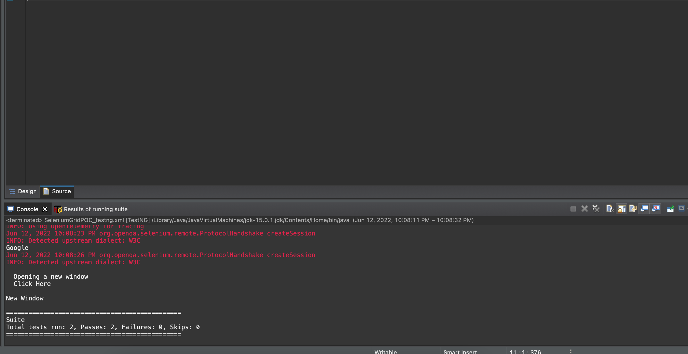

# Gridpoc

Downloaded Selenium server jar .Using command line launched hub and node on the same machine.Selenium grid launched with hub and node which can be viewed on http://localhost:4444 using browser

Wrote sample test cases to run on grid using Desired Capabilities (to select browser and os) and RemoteWebDriver objects

Running the testcases through testng xml

Passed results

